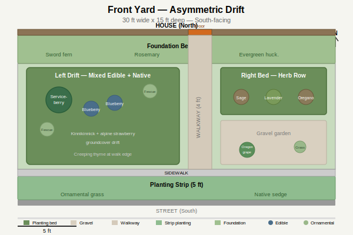

# Front Yard

- Dimensions: 30x15 ft
- Orientation: South-facing, full sun
- Existing: Walkway (4 ft wide, straight, door slightly right of center), 2 ft foundation strip, 5 ft planting strip at street
- Style: Clean modern PNW native with stealth edibles

## Design — Asymmetric Drift

### Zone Summary

- **Left drift (large bed):** Serviceberry anchors the left corner as a small multi-stem tree providing vertical interest, spring bloom, and edible berries. Two blueberries cluster nearby for fall color and fruit. Idaho fescue grasses add texture. Kinnikinnick and alpine strawberry form the groundcover layer, with creeping thyme softening the walkway edge. This zone creates a layered PNW forest-edge feel while producing berries and herbs.
- **Right herb bed (upper):** Sage, lavender, and oregano in a clean row. These Mediterranean herbs thrive in south-facing full sun and read as ornamental while being fully edible. Lavender adds pollinator value and fragrance.
- **Right gravel garden (lower):** Low Oregon grape (native, edible berries) with an ornamental grass accent in decomposed granite. Provides low-maintenance textural contrast and keeps the sightline to the front door open.
- **Foundation bed (2 ft):** Sword fern (native, shade-tolerant near house wall), rosemary (architectural form, edible), and evergreen huckleberry (broadleaf evergreen with edible berries — reads like boxwood).
- **Planting strip (5 ft, street side):** Ornamental grass and native sedge. Low-maintenance, no irrigation needed once established.

### Key Decisions

- **Asymmetric layout** chosen over symmetric to create natural visual movement toward the front door while maintaining an open sightline from the street.
- **Serviceberry as anchor tree** because it is PNW native, stays compact (12-15 ft), has four-season interest (spring bloom, summer fruit, fall color, winter branching), and its berries attract birds.
- **Stealth edible strategy** — every edible plant was selected for its ornamental qualities first: blueberries for fall color, rosemary for form, alpine strawberry for evergreen groundcover, evergreen huckleberry for broadleaf structure.
- **Gravel garden on right** keeps the door-side open and low, avoiding a closed-in feeling on approach.
