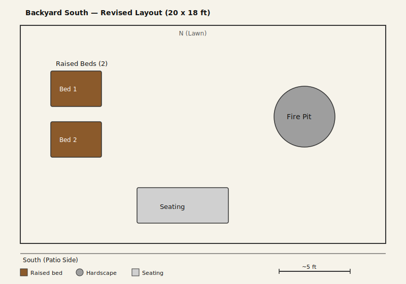

# Backyard South
- Dimensions: 20x18 ft
- Orientation: South edge at patio, north edge to lawn
- Existing features: fire pit on east side, 2 raised beds on west side, seating near patio

## Design

### Zone Summary
- **Fire pit (east side):** Relocated from west to east. Positions smoke downwind from prevailing westerlies, away from patio seating.
- **Raised beds (west side, 2):** Reduced from 4 to 2 and moved west. Keeps growing area close to the patio for convenient access.
- **Seating (south, near patio):** Unchanged. Central position with clear paths to both fire pit and beds.

### Key Decisions
- **Fire pit moved east** — better smoke management given Portland's prevailing west winds; more separation from patio seating.
- **Beds reduced to 2** — simplifies maintenance; frees east side for the fire pit zone.
