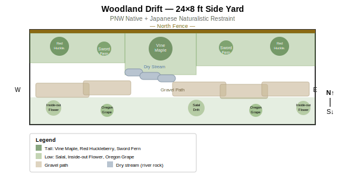

# Side Yard

- Dimensions: 24x8 ft
- Orientation: East-west corridor with partial shade
- Existing: Narrow path, fence on north edge
- Style: PNW native with Japanese naturalistic influence

## Design: Woodland Drift

### Zone Summary

- **North bed (fence-side, 2–4 ft deep):** Tall layered planting — Vine Maple as canopy anchor at center, flanked by Red Huckleberry at each end, Sword Fern clusters filling gaps. Softens the fence and creates overhead enclosure. Variable bed depth adds naturalistic rhythm.
- **Dry stream accent (~8 ft, center-east):** River rock bed bridging the north planting and gravel path. A karesansui (dry landscape) nod that channels rainwater during winter and reads as sculptural texture in summer.
- **Gravel path (center-south, full length):** Continuous decomposed granite path for easy passage. Functional for bins, carts, and foot traffic while maintaining clean Japanese restraint.
- **South planting pockets (2–3 ft deep):** Low evergreen drifts — Salal and Oregon Grape for year-round structure, Inside-out Flower for spring ephemeral interest. Kept low to preserve openness on the south side.

### Key Decisions

- **Gravel over stepping stones** — chosen for utility in a working side yard (wheelbarrow, bins) while still reading as clean and intentional.
- **Dry stream over water basin** — lower maintenance, no plumbing, and performs double duty as drainage feature in Portland's wet winters.
- **Red Huckleberry over Vine Maple at ends** — lighter canopy at entry/exit points keeps the corridor feeling open; the single Vine Maple at center creates a focal moment.
- **All PNW natives** — zero irrigation needed once established in Portland's climate; Japanese influence expressed through restraint, asymmetry, and clean material palette rather than non-native species.

### Optional Ideas

- Stone lantern or small boulder at dry stream head for stronger Japanese focal point.
- Evergreen huckleberry swap for one Red Huckleberry if more winter screening needed.
