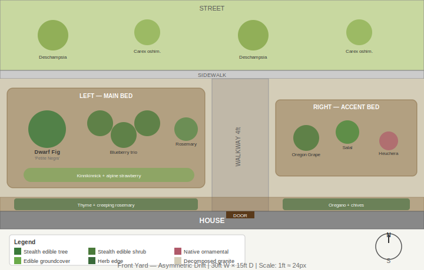

# Front Yard

- Dimensions: 30×15 ft
- Orientation: South-facing, full sun
- Walkway: 4 ft wide, straight, front door slightly right of center
- Foundation strip: 2 ft along house
- Planting strip: 5 ft between sidewalk and curb
- Groundplane: Decomposed granite (replaces lawn)

## Design — Asymmetric Drift

**Style:** Clean modern PNW native with stealth edibles integrated among ornamentals.

### Zone Summary

| Zone | Size | Plants | Why |
|------|------|--------|-----|
| **Left main bed** | ~14×7 ft | Dwarf fig 'Petite Negra' (anchor), 3 blueberries, rosemary, kinnikinnick + alpine strawberry groundcover | Largest bed creates visual weight on the left, drawing the eye before it follows the open granite to the front door. Fig provides architectural height; blueberry trio gives fall color mass; rosemary adds evergreen winter structure. |
| **Right accent bed** | ~10×5.5 ft | Oregon grape, salal, heuchera | PNW native trio — Oregon grape and salal produce edible berries while reading as ornamental shrubs. Heuchera adds foliage color contrast. Lighter planting preserves the open sightline to the door. |
| **Foundation strip** | 2×30 ft | Thyme + creeping rosemary (left), oregano + chives (right) | Reflected heat from house wall creates ideal microclimate for Mediterranean herbs. Low-growing, fragrant, evergreen. |
| **Planting strip** | 5×30 ft | Deschampsia cespitosa, Carex oshimensis | True PNW native grasses. Alternating species creates rhythm at street level. Low maintenance, no irrigation once established. |
| **Groundplane** | — | Decomposed granite | Permeable, zero-lawn maintenance, modern clean look, provides visual contrast against green plantings. |

### Key Decisions

- **Asymmetric layout over symmetric** — bolder, more naturalistic, higher food yield. The visual weight on the left creates a natural eye path to the front door.
- **Decomposed granite over lawn** — eliminates mowing, reads modern, PNW-appropriate. Permeable surface handles Portland rain.
- **Stealth edibles strategy** — every edible plant was chosen for dual ornamental value (fig = architectural form, blueberry = fall color, Oregon grape = state flower, rosemary = evergreen mound). No plant reads as "vegetable garden."
- **Dwarf fig 'Petite Negra'** — stays 4-6 ft, dramatic lobed foliage, produces dark figs. May need fleece wrap in coldest 8b winters.

### Optional Ideas

- Replace one Deschampsia with a dwarf serviceberry in the planting strip for spring bloom + berries.
- Add a small boulder grouping in the left bed for PNW naturalism.
- Underplant blueberries with lingonberry groundcover for additional edible layer.
