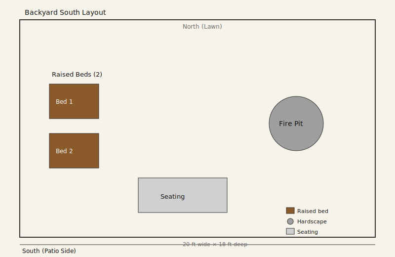

# Backyard South
- Dimensions: 20x18 ft
- Orientation: South edge at patio, north edge to lawn

## Design

### Zone summary
- **West side — Raised beds (2):** Two beds stacked vertically, replacing the previous 4-bed grid. Fewer beds free up space and reduce maintenance while keeping productive growing area.
- **East side — Fire pit:** Relocated from the west side to open up the west for the beds and give the fire pit more separation from planting areas.
- **South center — Seating:** Near patio with clear path to both the fire pit and beds.

### Key decisions
- **Fire pit moved east:** Swapped to the opposite side to create better separation between fire and plantings, and to place the fire pit closer to open lawn for a more social gathering space.
- **Raised beds reduced from 4 to 2:** Simplifies maintenance and opens up the layout. Two beds still provide meaningful growing space.
