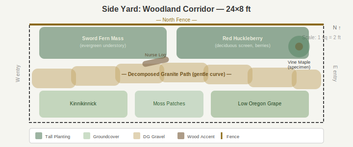

# Side Yard

- Dimensions: 24x8 ft
- Orientation: East-west corridor with partial shade
- Existing: Fence on north edge, narrow path kept clear through corridor
- Style: PNW native with Japanese influence, low maintenance

## Design — Woodland Corridor

### Zone Summary

| Zone | What | Why |
|------|------|-----|
| **North bed** (along fence, full width) | Sword fern mass (west 10 ft) + red huckleberry screen (east 11 ft) | Evergreen fern layer softens the fence year-round; huckleberry adds height, berries, and fall color on the east end |
| **Central path** | Decomposed granite with gentle curve, offset south | Low-maintenance walking surface that drains well; the subtle curve adds depth to a narrow space — a Japanese-influenced move in natural materials |
| **South groundcover mosaic** | Kinnikinnick (west) → moss patches (center) → low Oregon grape (east) | Three native groundcovers in a tapestry pattern; varied texture without height, keeping sight lines open across 8 ft of width |
| **Nurse log accent** | Salvaged log placed mid-corridor beside the path | PNW forest-floor character; over time it hosts moss and fern volunteers |
| **Vine maple specimen** (east end) | Single multi-stem Acer circinatum | Naturally sculptural form provides the Japanese-garden focal tree without any pruning; fall color anchors the east entry |

### Key Decisions

- **DG path over stepping stones** — chosen for lower maintenance, even footing, and wheelbarrow access through the corridor.
- **Groundcover mosaic over uniform moss** — moss patches for the look, but kinnikinnick and Oregon grape carry through dry summers without irrigation.
- **Red huckleberry over shore pine** — fits the narrow 8-ft width better, provides seasonal food, and needs no pruning.
- **Unpruned vine maple over cloud-pruned** — delivers Japanese-garden form naturally, eliminating annual skilled pruning.

### Optional Ideas

- Stone lantern at east entry for stronger Japanese accent.
- Basalt boulder grouping at west entry as an anchor feature.
- Low bamboo water feature (shishi-odoshi) near the vine maple.
