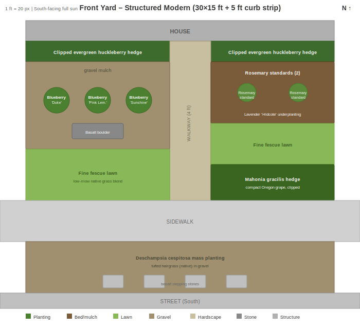

# Front Yard

- Dimensions: 30 ft wide × 15 ft deep (house to sidewalk) + 5 ft curb planting strip
- Orientation: South-facing, full sun
- Walkway: Straight, 4 ft wide, slightly right of center
- Foundation strip: 2 ft along house
- Style: Clean modern PNW native with stealth edibles

## Design

### Zone Summary

- **Foundation (both sides, 2 ft depth):** Clipped evergreen huckleberry hedge — native evergreen that reads as formal boxwood, produces edible berries, zero pest issues in Zone 8b. Provides year-round green backbone against the house.
- **Left main bed (14 ft × 8.5 ft, gravel mulch):** Three blueberry cultivars ('Duke', 'Pink Lemonade', 'Sunshine Blue') spaced 4 ft apart in gray gravel with a basalt boulder accent. Sculptural fruit shrubs on gravel creates a modern gallery aesthetic while producing summer berries. Gravel preserves the acidic soil blueberries need.
- **Right feature bed (12 ft × 6 ft):** Two rosemary standards (tree-form) with lavender 'Hidcote' underplanting. Formal topiary-style edible herbs with year-round structure and fragrance.
- **Right lower hedge (12 ft × 3.5 ft):** Clipped Mahonia gracilis — compact native Oregon grape with yellow spring blooms and blue-black edible berries. Defines the sidewalk approach.
- **Lawn panels (left 14 ft × 5 ft, right 12 ft × 4 ft):** Fine fescue native blend — low-mow, stays green through Portland's dry summers, clean geometric panels maintain open sightlines to the front door.
- **Curb strip (30 ft × 5 ft):** Deschampsia cespitosa mass planting in gravel with basalt stepping stones. Native tufted hairgrass provides year-round texture and movement.

### Key Decisions

- **Structured Modern over Cottage:** Chosen for stronger curb appeal — geometric beds, gravel mulch, and clipped forms read as intentional and designed from the street.
- **Stealth edibles strategy:** Every edible (blueberry, huckleberry, rosemary, lavender, Oregon grape) was selected because it looks like a high-end ornamental. No visible "food garden" signals.
- **Open sightlines preserved:** Lawn panels kept on both sides of the walkway to maintain clear visual path to the front door — important for both curb appeal and safety.
- **Three blueberry cultivars:** 'Duke' (early), 'Pink Lemonade' (mid, pink fruit), 'Sunshine Blue' (late, compact) — extends harvest from June through August and provides varied fall foliage color.
- **Gravel over bark mulch:** Gray gravel complements basalt accents, doesn't decompose, and keeps the modern aesthetic clean year-round.

### Optional Ideas

- Add low LED path lighting along walkway edges.
- Replace fine fescue with creeping thyme for a no-mow fragrant alternative.
- Add a second basalt boulder on the right side for visual balance.
