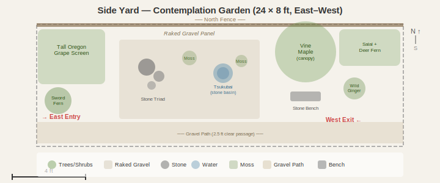

# Side Yard
- Dimensions: 24x8 ft
- Orientation: East-west corridor with partial shade
- Existing: Fence on north edge, 2.5 ft gravel path along south edge for passage
- Style: PNW native with Japanese influence — contemplation garden

## Design

### Zone Summary

- **Entry screen (east, 0–5 ft):** Tall Oregon grape hedge blocks the view inward, creating a "hide and reveal" moment on entry. Sword fern mass at ground level softens the base. Chosen because the screen transforms a corridor into a discovered garden room.
- **Dry gravel garden (center, 7–17 ft):** Raked gravel panel with an asymmetric stone triad and tsukubai (stone water basin). Moss mounds add PNW texture to the Japanese karesansui composition. Chosen because the open gravel panel creates visual breathing room in a narrow space and anchors the Japanese identity.
- **Vine maple alcove (west-center, 16–20 ft):** Multi-stem vine maple provides overhead canopy and seasonal color (spring red leaves, fall orange). Stone bench beneath for sitting and viewing the gravel garden. Chosen because the canopy creates a sense of enclosure and the bench gives the corridor a destination.
- **Exit planting (west, 20–24 ft):** Salal and deer fern screen with wild ginger groundcover. Frames the west exit with native evergreen texture.
- **Passage (south edge, full length):** 2.5 ft crushed gravel path maintained clear for pass-through circulation.

### Key Decisions

- **Contemplation over stroll:** Selected a destination-focused layout with a seated viewing point rather than a meandering stepping-stone path, because the 8 ft width rewards a single strong focal composition over distributed interest.
- **Dry garden over planted bed:** Raked gravel keeps the center open and low-maintenance; moss mounds add the PNW native character without irrigation or pruning needs.
- **Tsukubai for sensory depth:** A stone water basin adds sound and attracts birds without requiring plumbing — filled by hand or rain.
- **Oregon grape screen for enclosure:** Tall Oregon grape at the east entry hides the gravel garden from outside, creating surprise on arrival — a core Japanese garden principle (miegakure).
