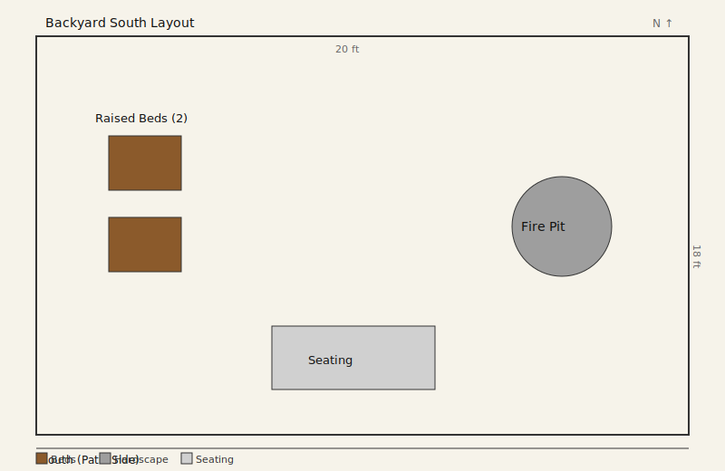

# Backyard South
- Dimensions: 20x18 ft
- Orientation: South edge at patio, north edge to lawn
- Existing features: fire pit on east side, 2 raised beds on west side, seating near patio

## Design

### Zone summary
- **West side — Raised beds (2):** Stacked vertically for easy access from the lawn edge. Reduced from 4 to 2 to open up the space.
- **East side — Fire pit:** Relocated from the west side to the east for better separation from the planting beds and a different sightline from seating.
- **South (patio) — Seating:** Centered near the patio with clear paths to both the beds and fire pit.

### Key decisions
- **Fire pit moved east:** Provides better spatial balance and separates fire/heat from the raised beds.
- **Beds reduced to 2:** Simplifies maintenance and opens floor area on the west side.
