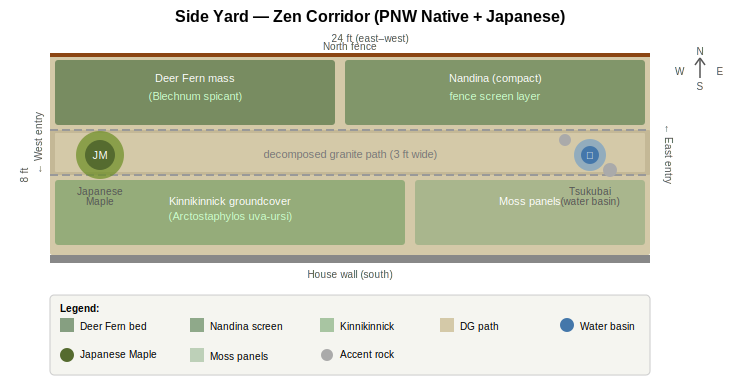

# Side Yard

- Dimensions: 24x8 ft
- Orientation: East-west corridor, partial shade
- Boundaries: Fence on north edge, house wall on south
- Style: PNW native with Japanese influence ("Zen Corridor")

## Design

### Zone Summary

- **Central path (3 ft wide):** Straight decomposed granite path with stone edging running the full 24 ft east-west. Clean lines evoke Japanese garden formality; DG is low-maintenance and permeable.
- **North bed (along fence):** Western half is a deer fern mass planting for lush, textural evergreen fill. Eastern half is compact nandina providing a privacy screen layer against the fence.
- **South bed (along house wall):** Kinnikinnick groundcover on the western two-thirds — a tough PNW native that stays flat and evergreen. Eastern third is moss panels for a soft, Japanese-inspired accent.
- **West focal point:** Japanese maple (*Acer palmatum*, compact cultivar) at the west entry — sets the tone on arrival with year-round form and fall color.
- **East destination:** Tsukubai (stone water basin) with grouped accent rocks — a traditional Japanese garden element that provides sound and a reason to walk through rather than past the corridor.

### Key Decisions

- **DG over stepping stones:** Chosen for accessibility, lower maintenance, and a cleaner Japanese aesthetic in the narrow 8-ft width.
- **Nandina for screening:** Provides year-round fence coverage. Not PNW-native, but the compact form is non-invasive and pairs well with the Japanese theme. Can substitute *Sarcococca ruscifolia* if native purity is preferred.
- **Kinnikinnick over moss for south groundcover:** More drought-tolerant near the house wall foundation; moss reserved for the shadier eastern section.
- **Japanese maple at west, tsukubai at east:** Creates a journey — living focal point on entry, water element as destination.
